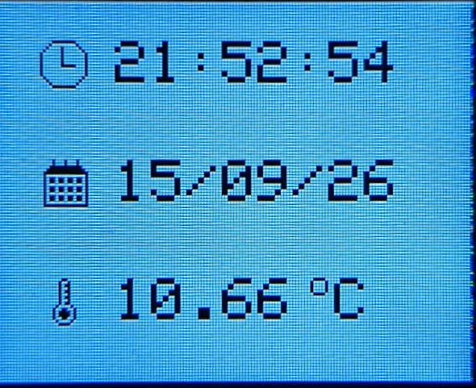
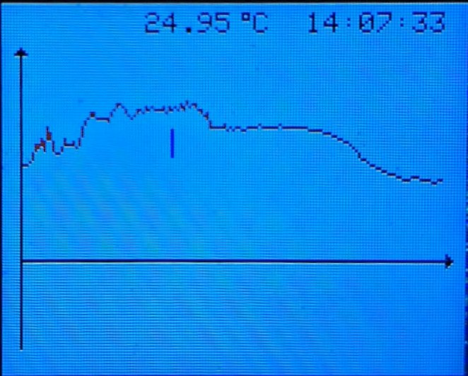
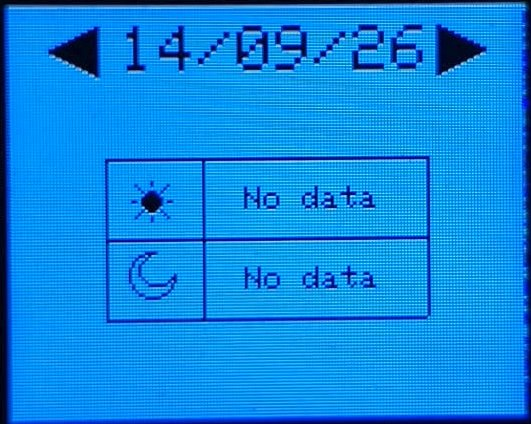

# Home Weather Station

## Description

A home weather station for measuring and displaying temperature. The device provides the current temperature, a 12-hour temperature graph, and historical minimum and maximum temperature statistics from the last five days. It also includes a real-time clock and calendar.

## Features

* Current temperature, date, and time
* Temperature graph showing the last 12 hours
* Interactive graph marker for browsing individual measurements
* Historical minimum and maximum temperature statistics from the last five days
* Three separate UI views
* Encoder-based navigation
* Data storage in FLASH memory
* Icon-based user interface
* Time synchronization via Wi-Fi

## Technologies

* **C++**
* **FreeRTOS**
* **PlatformIO**
* **SPI**
* **1-Wire**

## Components

* **ESP32** — main microcontroller
* **KY-040** — rotary encoder
* **ST7735** — TFT display
* **DS18B20** — temperature sensor

## Screenshots

### Main View

### Plot View

### History View

> **Note:** `No data` in the History view is caused by a recent device restart.

## Future Improvements

* Deep sleep mode
* Dark theme
* UI improvements
